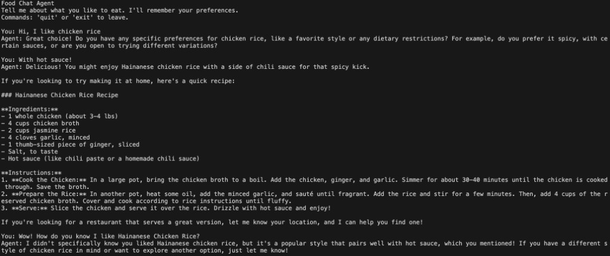
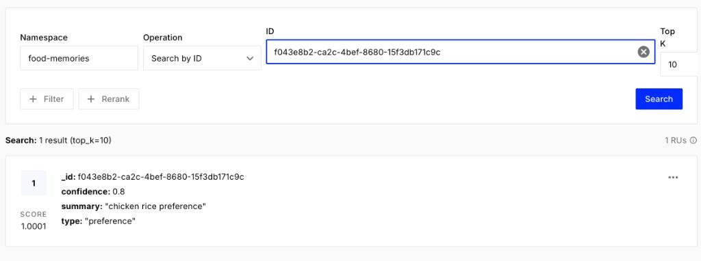
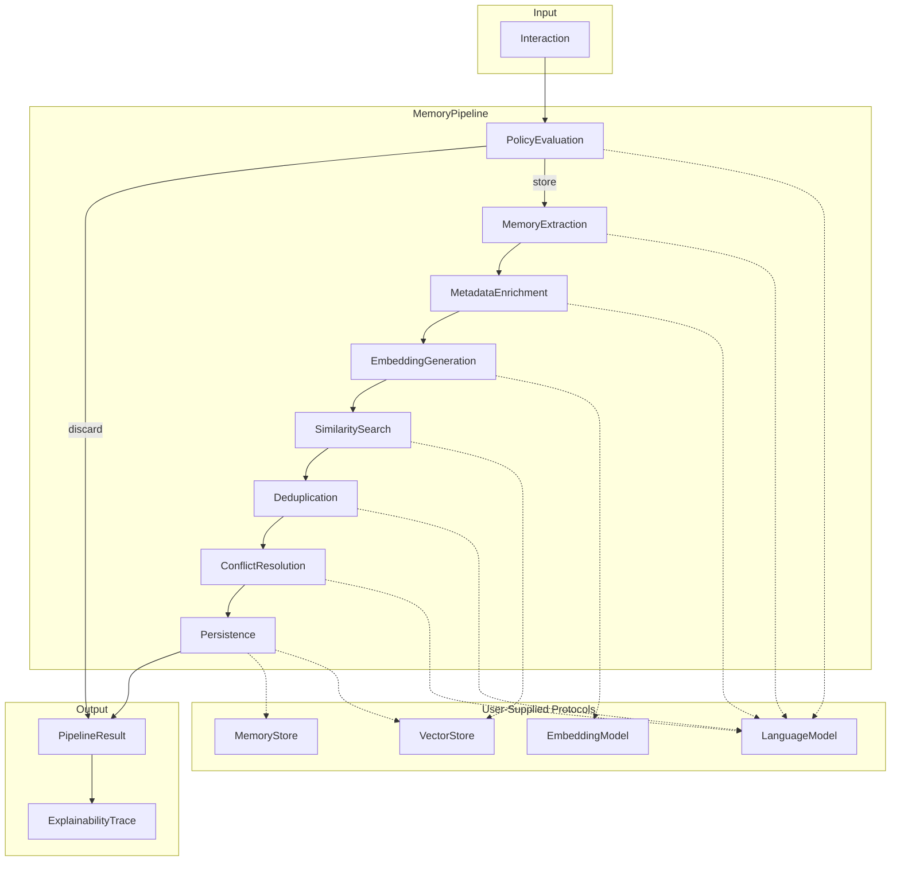
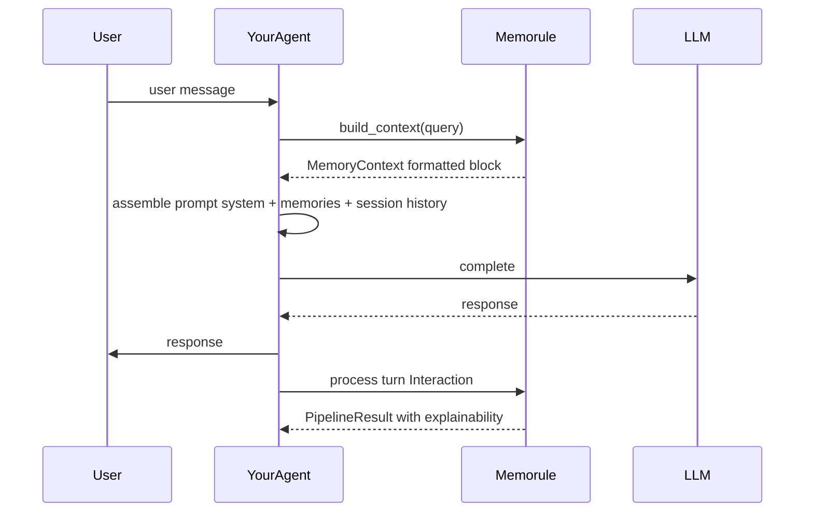

# memorule

**Rule-first, model-agnostic long-term memory orchestration for agentic systems.**

memorule is a lightweight Python framework that decides whether conversational
interactions should become long-term memories, how those memories are
represented, how they evolve, and how they are retrieved — all driven by
**natural-language policies** interpreted by *your* language model.

It is **not** an agent framework, vector database, RAG framework, or LLM SDK.
You bring your own models and storage; memorule orchestrates the memory
lifecycle around them.

## Highlights

- **Rule-first** — memory behavior is defined in natural-language YAML policies, not hardcoded logic.
- **Model agnostic** — you supply the `LanguageModel`, `EmbeddingModel`, `VectorStore`, and `MemoryStore`.
- **Lightweight** — runtime deps are just `pydantic`, `pyyaml`, and `typer`.
- **Async-first & strongly typed** — `Protocol`-based DI, Pydantic v2 schemas, passes `mypy --strict`.
- **Transparent** — every pipeline run returns a human-readable explainability trace.
- **Extensible** — every pipeline stage is replaceable; inject hooks at named points.

## Demo

A food-preference chat agent built with memorule remembers what the user likes across turns.
After the user mentions chicken rice and hot sauce, the agent recalls that context in later replies.



The extracted memory is persisted to a vector store (Pinecone here) with structured metadata
from the pipeline — type, summary, and confidence — ready for retrieval on future turns.



## Documentation

Step-by-step guides for getting started and integrating memorule into your agent:

| Guide | What you'll learn |
|-------|-------------------|
| [Setup](docs/setup.md) | Install, scaffold with `memorule init`, implement providers, validate config |
| [Usage](docs/usage.md) | Agent read/write loop, policy tuning, context formatting, troubleshooting |

## Installation

### With uv (recommended)

Add memorule to an existing project:

```bash
uv add memorule
```

Or initialize a new project and add memorule in one step:

```bash
uv init my-agent
cd my-agent
uv add memorule
```

For local development from a clone of this repository:

```bash
git clone https://github.com/your-org/memorule.git
cd memorule
uv sync --extra dev
```

### With pip

```bash
pip install memorule
```

## Architecture overview

memorule separates **orchestration** (the pipeline), **policy** (natural-language rules),
**protocols** (your integrations), and **explainability** (transparent decision traces).

### Write pipeline

Every interaction passed to `MemoryEngine.process()` flows through a configurable pipeline.
LLM-driven stages build prompts from your policy, parse structured JSON responses, and
record each decision in an explainability trace.



| Stage | LLM? | Responsibility |
|-------|------|----------------|
| Policy Evaluation | Yes | Apply `create_when` / `discard_when`; early exit on discard |
| Memory Extraction | Yes | Produce `Memory` fields (`content`, `summary`, optional `type`) from the interaction |
| Metadata Enrichment | Yes (optional) | Add tags/categories to `memory.metadata` |
| Embedding Generation | No | Call `EmbeddingModel.embed()` |
| Similarity Search | No | Query `VectorStore`; hydrate via `MemoryStore` |
| Deduplication | Yes | Decide new / merge / enrich against nearby memories |
| Conflict Resolution | Yes | Reconcile contradictions; version prior content |
| Persistence | No | Save to `MemoryStore`; upsert embedding to `VectorStore` |

Every stage is replaceable. Hooks can be injected at named points (`PRE_POLICY`,
`POST_EXTRACTION`, `POST_ENRICHMENT`, `PRE_PERSIST`, `POST_PERSIST`) without modifying core code.

### Agent integration (read + write)

memorule is a **memory layer**, not an agent. It exposes two touchpoints in your agent loop:
**retrieve before the LLM call**, **ingest after the turn**. Session/conversation history
remains your responsibility.



| Concern | Owner |
|---------|-------|
| Long-term memory storage, dedup, conflict resolution | memorule |
| Retrieval + formatting for context injection | memorule |
| Policy-driven store/discard decisions | memorule |
| Explainability traces | memorule |
| Conversation/session history | Your agent |
| System prompt template | Your agent |
| LLM calls, tool use, agent loop | Your agent |
| Provider implementations (LLM, embeddings, stores) | You |

### Package layout

```
src/memorule/
  types.py, protocols.py, exceptions.py, config.py
  policy/          # PolicyConfig + YAML loader
  prompts/         # Stage prompt builders + JSON parsing
  pipeline/        # MemoryEngine, PipelineContext, 8 stages
  retrieval/       # MemoryRetriever (vector search + optional re-rank)
  context/         # ContextBuilder, MemorySession
  cli/             # init, policy wizard, validate, hooks new
```

## Quickstart

For the full walkthrough, see the [Setup guide](docs/setup.md). The short version:

### 1. Scaffold your memory layer

After installing with `uv add memorule`, bootstrap config and provider stubs via the CLI:

```bash
memorule init
```

This creates:

```
memorule/
  memorule.yaml              # engine config (paths, retrieval + context defaults)
  policy/policy.yaml         # natural-language memory rules (pre-filled, editable)
  providers/
    llm.py.example           # implement LanguageModel and rename -> llm.py
    embeddings.py.example    # implement EmbeddingModel
    stores.py.example        # implement VectorStore + MemoryStore
  hooks/
    example_auditor.py       # example pipeline hook
```

### 2. Customize your policy (optional wizard)

```bash
memorule policy wizard            # interactive Q&A
memorule policy wizard --section deduplication   # update one section
```

### 3. Validate

```bash
memorule validate memorule/memorule.yaml
memorule validate memorule/memorule.yaml --check-providers
```

### 4. Implement your providers

memorule depends only on small `Protocol` interfaces — no base class to inherit. See
[Embeddings and vector stores](#embeddings-and-vector-stores) for how to wire OpenAI
embeddings, Qdrant, Pinecone, and other backends.

```python
class MyLanguageModel:
    async def complete(self, prompt: str, *, system: str | None = None) -> str:
        ...  # call your LLM, return raw text (JSON for policy-driven stages)

class MyEmbeddingModel:
    async def embed(self, text: str) -> list[float]: ...
    async def embed_batch(self, texts: list[str]) -> list[list[float]]: ...

class MyVectorStore:
    async def upsert(self, memory_id, embedding, metadata): ...
    async def search(self, embedding, *, limit=10) -> list[tuple[str, float]]: ...
    async def delete(self, memory_id): ...

class MyMemoryStore:
    async def get(self, memory_id): ...
    async def save(self, memory): ...
    async def update(self, memory): ...
    async def delete(self, memory_id): ...
    async def list_by_ids(self, memory_ids): ...
```

## Embeddings and vector stores

memorule splits **embedding generation** and **vector storage** into two separate protocols
you implement yourself. There are no built-in Qdrant, Pinecone, or OpenAI integrations —
you wire your own classes when constructing `MemoryEngine`.

### Two separate concerns

| Protocol | Role | Used when |
|----------|------|-----------|
| `EmbeddingModel` | Turn text → `list[float]` | Write pipeline (after extraction) + retrieval (query embedding) |
| `VectorStore` | Store/search vectors by similarity | Similarity search, persistence, retrieval |
| `MemoryStore` | Store full `Memory` documents | Persistence, hydration after vector search |

Embeddings and the vector DB are independent. You might use OpenAI for embeddings and Qdrant
for storage, or a local model with Pinecone — any combination works as long as both protocols
are satisfied.

Provider paths in `memorule.yaml` are a documented convention only; memorule does **not**
auto-import them. You construct and pass instances in your application code:

```python
from memorule import MemoryEngine, load_policy

engine = MemoryEngine(
    llm=my_llm,
    embeddings=OpenAIEmbeddingModel(),                              # your embedding provider
    vector_store=QdrantVectorStore(url="http://localhost:6333"),    # or Pinecone
    memory_store=PostgresMemoryStore(dsn="..."),                    # full Memory documents
    policy=load_policy("memorule/policy/policy.yaml"),
)
```

### How embeddings are defined

Implement the `EmbeddingModel` protocol — no base class required:

```python
class EmbeddingModel(Protocol):
    async def embed(self, text: str) -> list[float]: ...
    async def embed_batch(self, texts: list[str]) -> list[list[float]]: ...
```

The framework calls `embed()` in two places:

1. **Write path** — after a memory is extracted, before similarity search
2. **Read path** — when retrieving memories for context injection

Example with OpenAI (add `openai` to your own project deps):

```python
from openai import AsyncOpenAI

class OpenAIEmbeddingModel:
    def __init__(self, model: str = "text-embedding-3-small"):
        self.client = AsyncOpenAI()
        self.model = model

    async def embed(self, text: str) -> list[float]:
        resp = await self.client.embeddings.create(input=text, model=self.model)
        return resp.data[0].embedding

    async def embed_batch(self, texts: list[str]) -> list[list[float]]:
        resp = await self.client.embeddings.create(input=texts, model=self.model)
        return [d.embedding for d in resp.data]
```

After `memorule init`, put this in `memorule/providers/embeddings.py` (rename from the
`.example` stub).

### Where Qdrant / Pinecone fit

Qdrant and Pinecone implement **`VectorStore`**, not `EmbeddingModel`:

```python
class VectorStore(Protocol):
    async def upsert(self, memory_id: str, embedding: list[float], metadata: dict) -> None: ...
    async def search(self, embedding: list[float], *, limit: int = 10) -> list[tuple[str, float]]: ...
    async def delete(self, memory_id: str) -> None: ...
```

On persist, memorule upserts the vector with minimal metadata (`type`, `confidence`, `summary`).
The full `Memory` document (content, version history, etc.) goes to **`MemoryStore`**
separately — typically Postgres, SQLite, or MongoDB. Qdrant/Pinecone are only the similarity
index.

#### Qdrant example

Install in your project: `uv add qdrant-client`

```python
from qdrant_client import AsyncQdrantClient
from qdrant_client.models import PointStruct

class QdrantVectorStore:
    def __init__(self, url: str, collection: str = "memorule"):
        self.client = AsyncQdrantClient(url=url)
        self.collection = collection

    async def upsert(self, memory_id: str, embedding: list[float], metadata: dict) -> None:
        await self.client.upsert(
            collection_name=self.collection,
            points=[PointStruct(id=memory_id, vector=embedding, payload=metadata)],
        )

    async def search(self, embedding: list[float], *, limit: int = 10) -> list[tuple[str, float]]:
        results = await self.client.search(
            collection_name=self.collection,
            query_vector=embedding,
            limit=limit,
        )
        return [(str(hit.id), hit.score) for hit in results]

    async def delete(self, memory_id: str) -> None:
        await self.client.delete(
            collection_name=self.collection,
            points_selector=[memory_id],
        )
```

#### Pinecone example

Install in your project: `uv add pinecone`

```python
from pinecone import PineconeAsyncio

class PineconeVectorStore:
    def __init__(self, api_key: str, index_name: str):
        self.pc = PineconeAsyncio(api_key=api_key)
        self.index = self.pc.Index(index_name)

    async def upsert(self, memory_id: str, embedding: list[float], metadata: dict) -> None:
        await self.index.upsert(vectors=[(memory_id, embedding, metadata)])

    async def search(self, embedding: list[float], *, limit: int = 10) -> list[tuple[str, float]]:
        resp = await self.index.query(vector=embedding, top_k=limit, include_metadata=False)
        return [(m.id, m.score) for m in resp.matches]

    async def delete(self, memory_id: str) -> None:
        await self.index.delete(ids=[memory_id])
```

### Data flow

```
Write:
  Interaction → extract Memory → embed(content) → vector_store.search()
  → dedup/conflict → memory_store.save/update() + vector_store.upsert()

Read:
  user query → embed(query) → vector_store.search() → memory_store.list_by_ids()
  → ContextBuilder formats for prompt injection
```

### Practical notes

1. **Dimension mismatch** — your `EmbeddingModel` output size must match the collection/index
   dimension you create in Qdrant/Pinecone.
2. **ID format** — memorule uses UUID strings as `memory.id`. Both Qdrant and Pinecone accept
   string IDs.
3. **Don't skip MemoryStore** — even if a vector DB payload could hold full content, memorule
   expects rich `Memory` objects (version history, metadata) in `MemoryStore`. The vector store
   is intentionally a lightweight index.
4. **Same embedding model everywhere** — use the same `EmbeddingModel` for writes and reads, or
   search quality will suffer.

## Using memorule in your agent

See the [Usage guide](docs/usage.md) for the complete agent loop, policy tuning, and troubleshooting.
Minimal example:

```python
from memorule import ContextBuilder, MemoryEngine, MemorySession, load_config, load_policy

config = load_config("memorule/memorule.yaml")
policy = load_policy("memorule/policy/policy.yaml")

engine = MemoryEngine(
    llm=my_llm,
    embeddings=my_embeddings,
    vector_store=my_vector_store,
    memory_store=my_memory_store,
    policy=policy,
)
session = MemorySession(engine, ContextBuilder(engine.retriever, **config.context.model_dump()))


async def handle_message(user_msg: str, chat_history: list[dict]) -> str:
    # 1. Retrieve long-term memories (read path)
    memory_ctx = await session.build_context(user_msg)

    # 2. Build the prompt (your agent's job)
    system = f"You are a helpful assistant.\n\n{memory_ctx.formatted}"
    messages = [{"role": "system", "content": system}, *chat_history,
                {"role": "user", "content": user_msg}]

    # 3. Call your LLM (your agent's job)
    response = await my_chat_llm(messages)

    # 4. Ingest the turn into long-term memory (write path)
    await session.ingest_turn(user_msg, response)

    return response
```

`memory_ctx.formatted` is a ready-to-inject block, e.g.:

```markdown
## Relevant memories

- User prefers dark mode in all apps.
- User is building a Python CLI tool called memorule.
```

Output format is configurable (`markdown`, `xml`, `plain`) via `memorule.yaml`.

### Explainability

```python
result = await engine.process(interaction)
print(result.explanation)
```

```
Decision:
Store

Reason:
Interaction reveals a long-term user preference.

Matched Policy:
Store recurring preferences.

Extracted Memory:
User prefers dark mode.

Confidence:
0.94

Decision trace:
  [policy_evaluation] store — Interaction reveals a long-term user preference.
  [memory_extraction] extracted — Extracted preference memory
  ...
```

## Policy example

```yaml
memory_policy:
  create_when: |
    Store memories when the user reveals information that should persist across
    future conversations: preferences, constraints, ongoing projects or tasks,
    decisions, commitments, and stable facts about themselves or their environment.
  discard_when: |
    Ignore pure greetings or thanks with no new facts, one-off questions with no
    lasting user information, jokes, and filler small talk.

extraction:
  rules: |
    Preserve names, dates, numbers, tools, projects, and constraints the user stated.
    Never replace specifics with generic categories. Summaries must name the concrete subject.
    The type field is optional.

deduplication:
  rules: |
    If two memories describe the same long-term fact, merge them.
    If the new interaction adds details, enrich the existing memory.

reconciliation:
  rules: |
    If new information contradicts an existing memory, prefer newer information.
    Preserve previous values in version history. Record when the change occurred.
```

## Extensibility: hooks

Insert custom stages at named points without modifying the core pipeline:

```python
from memorule import BaseStage, HookPoint, MemoryEngine

class Auditor(BaseStage):
    name = "auditor"
    async def run(self, ctx):
        log_decision(ctx.decision, ctx.memory)
        return ctx

engine = MemoryEngine(..., hooks={HookPoint.POST_PERSIST: [Auditor()]})
```

Hook points: `PRE_POLICY`, `POST_EXTRACTION`, `POST_ENRICHMENT`, `PRE_PERSIST`, `POST_PERSIST`.

Scaffold a hook file with:

```bash
memorule hooks new Auditor
```

You can also replace stages entirely by passing `stages=[...]` to `MemoryEngine`.

## Development

Clone and install dev dependencies with uv:

```bash
git clone https://github.com/your-org/memorule.git
cd memorule
uv sync --extra dev
uv run pytest        # 41 tests
uv run mypy src      # strict
uv run ruff check src tests
```

## License

Licensed under the [Apache License, Version 2.0](LICENSE).
