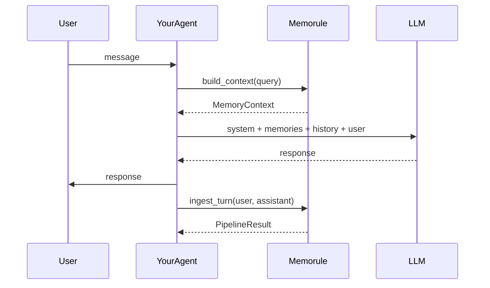

# Usage guide

How to use memorule in a conversational agent: retrieve memories before each LLM call,
ingest turns after each reply, and tune policy and context formatting.

## Mental model

memorule is a **memory layer**, not an agent. Your code owns:

- The chat loop and session history
- The system prompt and tool use
- Direct LLM calls for chat (separate from memorule's policy LLM)

memorule owns:

- Whether a turn becomes a long-term memory
- Memory extraction, deduplication, and conflict resolution
- Vector search and formatted context for prompt injection



## Basic agent loop

The simplest integration uses `MemorySession`, which bundles retrieval and ingestion:

```python
from memorule import ContextBuilder, MemoryEngine, MemorySession, load_config, load_policy

config = load_config("memorule/memorule.yaml")
policy = load_policy("memorule/policy/policy.yaml")

engine = MemoryEngine(
    llm=policy_llm,           # used by memorule pipeline stages
    embeddings=embeddings,
    vector_store=vector_store,
    memory_store=memory_store,
    policy=policy,
)

session = MemorySession(
    engine,
    ContextBuilder(
        engine.retriever,
        format=config.context.format,
        max_memories=config.context.max_memories,
        header=config.context.header,
        include_metadata=config.context.include_metadata,
        min_confidence=config.retrieval.min_confidence,
    ),
)


async def handle_message(user_msg: str, chat_history: list[dict]) -> str:
    # 1. Read path — retrieve relevant long-term memories
    memory_ctx = await session.build_context(user_msg)

    # 2. Build prompt (your agent's job)
    system = "You are a helpful assistant."
    if memory_ctx.formatted:
        system += f"\n\n{memory_ctx.formatted}"

    messages = [
        {"role": "system", "content": system},
        *chat_history,
        {"role": "user", "content": user_msg},
    ]

    # 3. Chat LLM call (your agent's job — can be same or different model)
    response = await chat_llm(messages)

    # 4. Write path — maybe store this turn as long-term memory
    result = await session.ingest_turn(user_msg, response)

    if result.decision.value == "store":
        print(f"Stored memory: {result.memory.content if result.memory else ''}")

    return response
```

### What `ingest_turn` sends to the pipeline

`MemorySession.ingest_turn` wraps the user and assistant messages into one `Interaction`:

```
User: I like chicken rice
Assistant: Great choice! Hainanese chicken rice pairs well with chili sauce.
```

Policy evaluation decides whether that combined turn is worth storing. Greetings and small talk
are typically discarded; preferences and facts are stored.

For full control, use `session.ingest(Interaction(...))` directly.

## Read path: retrieval and context

### MemoryContext

`build_context(query)` returns:

| Field | Description |
|-------|-------------|
| `memories` | List of `Memory` objects ranked by relevance |
| `formatted` | Ready-to-inject string (markdown, XML, or plain) |
| `trace` | Explainability trace for retrieval steps |

Example formatted output (markdown):

```markdown
## Relevant memories

- User likes grilled food and dislikes soup
- User prefers Hainanese chicken rice with hot sauce
```

Inject `memory_ctx.formatted` into your system prompt or a dedicated context block.

### Context format options

Set in `memorule.yaml` under `context`:

| `format` | Output style |
|----------|--------------|
| `markdown` | Header + bullet list (default) |
| `xml` | `<memories><memory>...</memory></memories>` |
| `plain` | One memory per line, no header |

Other options:

- `max_memories` — cap how many memories appear in the formatted block
- `header` — markdown section title
- `include_metadata` — append `(type, confidence: 0.9)` to each line
- `retrieval.min_confidence` — filter low-confidence memories

### Direct retrieval (without ContextBuilder)

```python
from memorule import RetrievalQuery

result = await engine.retrieve(RetrievalQuery(
    content="what food do I like?",
    limit=5,
    min_confidence=0.5,
))

for memory, score in zip(result.memories, result.scores):
    print(score, memory.content)
```

## Write path: processing interactions

### Single interaction

```python
from memorule import Interaction

result = await engine.process(Interaction(
    content="I prefer dark mode in all my apps.",
    source="onboarding",
    metadata={"channel": "web"},
))

print(result.decision)      # store | discard | merge | update | version
print(result.memory)        # extracted Memory, if stored
print(result.explanation)   # human-readable trace
```

### Pipeline stages (in order)

When policy says **store**, the full pipeline runs:

1. **policy_evaluation** — store or discard
2. **memory_extraction** — type, content, summary, confidence
3. **metadata_enrichment** — optional tags (if configured in policy)
4. **embedding_generation** — embed `memory.content`
5. **similarity_search** — find nearby existing memories
6. **deduplication** — new, merge, or enrich
7. **conflict_resolution** — update, version, or keep existing
8. **persistence** — save to `MemoryStore` + upsert vector

On **discard**, the pipeline stops after policy evaluation.

### Explainability

Every `process()` call returns a trace:

```python
result = await engine.process(interaction)
print(result.explanation)
```

Use this to debug why a turn was stored, merged, or discarded.

## Policy

Rules live in `memorule/policy/policy.yaml` as natural language. Your `LanguageModel` interprets them.

### Required sections

```yaml
memory_policy:
  create_when: |
    Store memories when ...
  discard_when: |
    Ignore greetings, ...

deduplication:
  rules: |
    If two memories describe the same fact, merge them.

reconciliation:
  rules: |
    If new information contradicts an existing memory, prefer newer information.
```

### Optional sections

```yaml
metadata_enrichment:
  rules: |
    Tag memories with category and keywords.

retrieval:
  rules: |
    Return only memories directly relevant to the query.
```

When `metadata_enrichment` is present, an LLM stage adds tags and metadata to `memory.metadata`.
When `retrieval.rules` is present, an LLM re-ranks candidates during retrieval.

### Tuning tips

- Be specific in `create_when` / `discard_when` for your domain (e.g. food preferences, project facts).
- Tight `discard_when` reduces noise from casual chat.
- Deduplication rules matter once you have many memories about the same topic.

## Hooks and custom stages

Inject logic at named points without forking the pipeline:

```python
from memorule import BaseStage, HookPoint, MemoryEngine

class Auditor(BaseStage):
    name = "auditor"

    async def run(self, ctx):
        if ctx.memory:
            print(f"[auditor] {ctx.decision} → {ctx.memory.id}")
        return ctx

engine = MemoryEngine(
    ...,
    hooks={HookPoint.POST_PERSIST: [Auditor()]},
)
```

Hook points: `PRE_POLICY`, `POST_EXTRACTION`, `POST_ENRICHMENT`, `PRE_PERSIST`, `POST_PERSIST`.

Scaffold a hook file:

```bash
memorule hooks new Auditor
```

Replace the entire default pipeline by passing `stages=[...]` to `MemoryEngine`.

## Two LLMs: policy vs chat

Many setups use one model for memorule pipeline stages (must return JSON) and another for user-facing chat.
They can be the same class with different prompts, or entirely different providers:

```python
engine = MemoryEngine(llm=policy_llm, ...)   # policy stages
response = await chat_llm(messages)          # user-facing
```

## Troubleshooting

### `StageExecutionError` in `memory_extraction`

The LLM returned structured JSON for `content` instead of a plain string. Recent versions coerce
dict/list values to JSON strings automatically; prefer prose in prompts. Ensure you are on the latest release.

### `StageExecutionError` in `persistence`: `threads can only be started once`

This comes from your `VectorStore` or `MemoryStore`, not memorule. Common causes:

- Calling `.start()` on the same `threading.Thread` in both `search()` and `upsert()`
- Reusing a `Timer` across operations

Fix: use one long-lived client and `await asyncio.to_thread(sync_call, ...)` for sync SDKs.
See [Setup — VectorStore](setup.md#vectorstore).

### No memories retrieved

- Confirm memories were stored (`result.decision == "store"`).
- Check `retrieval.min_confidence` is not filtering everything out.
- Verify the same `EmbeddingModel` is used for writes and reads.
- Confirm vector index dimension matches embedding output size.

### Everything gets discarded

- Review `memory_policy.discard_when` — it may be too broad.
- Check `ingest_turn` content — very short greetings are often correctly discarded.
- Inspect `result.explanation` for the policy evaluation reason.

### Provider JSON parse errors

Policy stages require valid JSON from your `LanguageModel.complete()`. Ensure your LLM adapter
returns raw JSON without markdown fences, or that your model follows the system prompt:
`Respond with valid JSON only, no markdown fences or extra text.`

## API reference

Full type and protocol definitions are in the [main README](../README.md) and source:

- `memorule.types` — `Interaction`, `Memory`, `PipelineResult`
- `memorule.protocols` — `LanguageModel`, `EmbeddingModel`, `VectorStore`, `MemoryStore`
